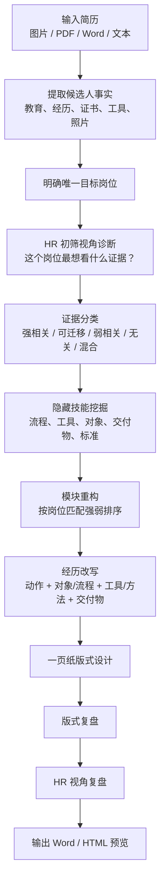

# Resume Rewriter CN

一个面向中文简历优化的 Codex Skill。它不是普通的简历润色提示词，而是把“简历顾问 + HR 初筛 + 岗位匹配分析”的工作流封装成一个可复用 Skill：读取原始简历，判断目标岗位，重组内容顺序，深度挖掘候选人经历中被忽略的技能、工具、流程和交付物，生成一页纸可投递简历，并完成版式与 HR 视角复盘。

## 它解决什么问题

很多学生或早期候选人的简历问题，不是“经历太少”，而是：

- 写了岗位名称，但没写清楚做过哪些具体流程。
- 写了任务结果，但没写出使用了什么工具、方法或标准。
- 写了校园活动，但没有转译成岗位认可的能力。
- 把弱相关内容写得很长，把 HR 真正在意的内容藏在后面。
- 简历看起来完整，但 HR 第一眼看不到“为什么这个人适合这个岗位”。

Resume Rewriter CN 的核心目标，就是把这些被忽略的信息从原始经历里挖出来，并用企业能识别的语言表达出来。

## 核心思路：从 HR 视角重写简历

这个 Skill 的判断标准不是“候选人有什么就写什么”，而是：

> 如果我是 HR，正在筛选这个岗位，我会优先寻找哪些证据？

因此它会按以下逻辑处理简历：

1. **先看岗位**：这份简历只服务一个求职岗位。
2. **再看证据**：专业、证书、工具、实习、项目、服役、荣誉，哪些能证明岗位匹配。
3. **再排顺序**：强相关经历放前面，弱相关经历压缩或删除。
4. **再挖过程**：从原文经历中推断企业认可的流程、工具、对象和交付物。
5. **最后复盘**：从版式和 HR 初筛两个角度检查是否可投递。

## 最独特的能力：深度挖掘经历里的隐藏技能

很多候选人会这样写：

```text
负责招聘支持。
参与质量检验。
完成 SolidWorks 项目。
组织校园活动。
参与护理志愿服务。
```

这些表达太浅，HR 看不到“你到底会什么”。Skill 会结合目标岗位和职业流程，把这些经历拆开分析：

| 原始信息 | HR 可能关心的问题 | 可挖掘出的隐藏价值 |
| --- | --- | --- |
| 招聘支持 | 是否懂招聘流程？是否会沟通候选人？是否会做台账？ | 招聘发布、简历初筛、候选人沟通、面试邀约、进度跟踪、Excel 台账 |
| 质量检验 | 检什么？按什么标准？能识别什么问题？ | 外观/孔位/尺寸/配合检查、毛刺/碰伤/变形识别、质量记录 |
| SolidWorks 项目 | 只是会建模，还是会输出工程交付物？ | 零件建模、装配检查、干涉检查、工程图、爆炸图、BOM |
| 校园活动 | 是否能证明组织执行能力？ | 任务分工、节点跟进、现场协调、资料整理、复盘 |
| 护理志愿服务 | 是否和护理岗位有关？ | 血压监测、健康宣教、患者沟通、老年群体服务、基础护理意识 |

Skill 不会编造未确认数据。它只补全合理的“过程、工具、对象、交付物”，不凭空添加人数、业绩、奖项、客户或结果。

## HR 视角如何改变简历

### 1. 不按原简历顺序，而按投递价值排序

原简历常见顺序是：教育背景、校园经历、实习、技能、自我评价。  
但 HR 更关心的是：哪些内容最能证明岗位匹配。

因此 Skill 会优先把这些内容前置：

- 岗位硬证书和资格。
- 强相关实习、项目、临床、产线或岗位实践。
- 关键工具和专业技能。
- 能形成差异化的经历，如服役、学生负责人、重要荣誉。

普通校园活动、弱相关志愿服务、泛泛自我评价会被压缩或删除。

### 2. 任职优势不是总结，而是第一屏证据

任职优势默认 3 条，最多 4 条。它不写“专业匹配、组织协调、数据能力”这种标签，而是直接列事实。

示例：

```text
• 机械设计制造及其自动化专业，GPA 3.3/4，专业前 10%。
• 具备金工、数控加工、SolidWorks 建模装配与工程图输出实训基础。
• 有自动化产线实习及精密零件质检经历，熟悉图纸识读、装配配合、外观/孔位/尺寸检查。
```

### 3. 弱相关经历不硬写，强相关部分要拆出来

例如护理简历里，礼仪队和训练营不应大段展开；但社区义诊、血压监测、护理宣教应该单独拆成护理志愿服务经历。

机械简历里，普通志愿服务可以不写；但质量检验、数控训练、SolidWorks 项目、产线实习应该前置并展开。

## 工作流程



## 适用场景

- 中文应届生、实习生、早期职场人简历优化。
- 用户只有图片、PDF、Word 或截图版简历。
- 简历内容像流水账，重点不突出。
- 经历写得像岗位职责，没有体现工具、流程和交付物。
- 需要根据 JD、目标岗位或目标企业重新定制简历。
- 需要生成一页纸、可编辑、适合投递的中文简历。

## 不做什么

- 不编造经历、公司、奖项、客户、数字或结果。
- 不把多个求职方向混在一份简历里。
- 不把应届生包装成资深专家。
- 不在正式简历正文中写“建议补充、待完善、可补充”。
- 不把证书技能写成前文经历的重复总结。

## 安装方式

将 `resume-rewriter-cn` 文件夹复制到 Codex skills 目录：

```bash
mkdir -p ~/.codex/skills
cp -R resume-rewriter-cn ~/.codex/skills/
```

在 Codex 中使用：

```text
Use $resume-rewriter-cn to diagnose, rewrite, and format this Chinese resume for one target job.
```

推荐输入：

- 原始简历文件或截图。
- 目标岗位名称。
- JD 或目标企业信息，如果有。
- 是否需要保留照片。
- 希望输出 Word 还是 HTML 预览。

## 仓库结构

```text
resume-rewriter-cn/
  SKILL.md
  agents/openai.yaml

examples/
  anonymized-cases.md

README.md
GITHUB_PUBLISHING_CHECKLIST.md
```

## 示例

查看 [examples/anonymized-cases.md](examples/anonymized-cases.md)，里面展示了 HR、护理、机械和校园经历的深度挖掘案例。

## 隐私与边界

请不要把真实简历、手机号、邮箱、照片、身份证明、学校/公司敏感信息、Word 成品或 HTML 预览上传到公开仓库。

建议公开仓库只包含 Skill 本体、说明文档和脱敏示例。
